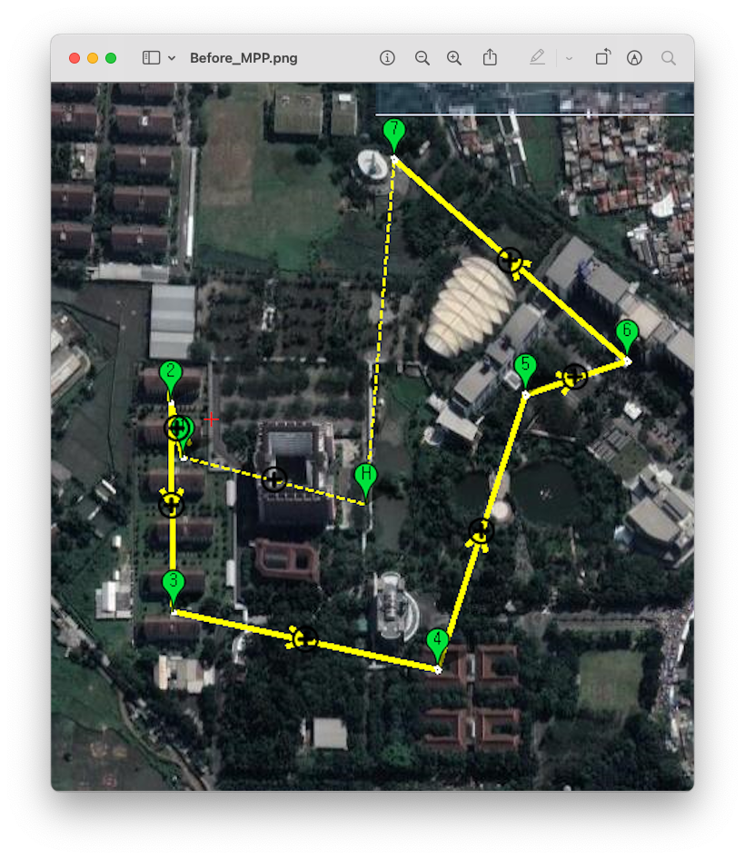
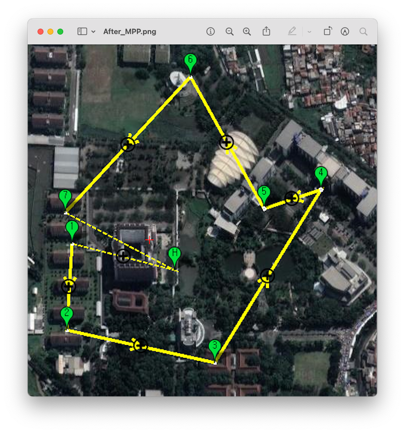
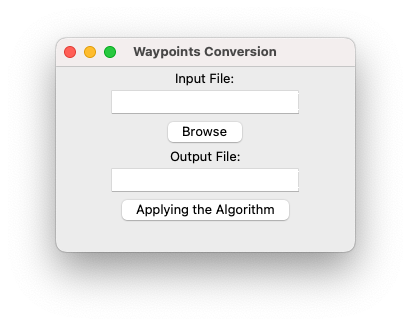
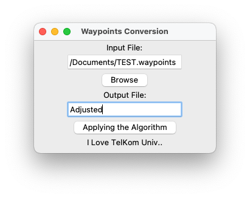

# MissionPlanner-PathFinder 🛩️

**Mission Planner**에서 생성된 Waypoint 경로를  
**외판원 문제(Traveling Salesman Problem, TSP)** 기반 알고리즘으로 재정렬하여  
드론의 **총 비행 거리와 불필요한 이동을 줄이기 위한 경로 최적화 도구**입니다.
> This tool optimizes waypoint sequences generated by **Mission Planner**  
> using a **Traveling Salesman Problem (TSP)** based algorithm,  
> aiming to **reduce total flight distance and eliminate unnecessary movements**  
> for more efficient drone missions.

---

## 프로젝트 배경 및 목적

본 프로젝트는 **2023년 인도네시아 Telkom University와 함께 진행한 글로벌 캡스톤 프로젝트**에서 수행한  
**「Long Distance Delivery Drone – 장거리 배송 드론」** 주제에서 파생되어 개발된 프로그램입니다.  
  
장거리 자율 비행 환경에서 드론의 **비행 효율과 배터리 사용 최적화**가 중요한 문제로 떠올랐고,  
이를 해결하기 위해 **Mission Planner의 Waypoint 경로를 알고리즘적으로 최적화하는 도구**를 개발하게 되었습니다.  
 
프로젝트의 전체 배경 및 시스템 구성에 대한 자세한 내용은 저장소에 첨부된   
**`Long Distance Delivery Drone - 장거리 배송 드론.pdf`**   
문서를 참고해주세요.

> This project was developed as part of a **2023 Global Capstone Design Project**  
> conducted in collaboration with **Telkom University, Indonesia**.  
>  
> The project originated from the topic  
> **“Long Distance Delivery Drone”**, focusing on efficient autonomous flight for long-range missions.  
>  
> This tool optimizes Mission Planner waypoint sequences using a  
> **TSP-based heuristic algorithm** to reduce unnecessary travel distance and improve flight efficiency.  
>  
> For detailed system design and project background, please refer to the attached PDF document.

---

## Mission Planner란?

**Mission Planner**는 ArduPilot 기반 비행체(Pixhawk 등)를 위한  
**오픈소스 지상 관제 소프트웨어(GCS)** 입니다.

주요 기능은 다음과 같습니다.

- Waypoint 기반 미션 설계
- 비행 컨트롤러와의 통신
- 실시간 비행 모니터링
- 비행 로그 분석

공식 사이트:  
https://ardupilot.org/planner/

Mission Planner에서 생성된 미션은  
**텍스트 기반의 `.waypoints` 파일**로 저장되며,  
파일에 기록된 **순서가 그대로 비행 순서**로 적용됩니다.

## Waypoint 파일 구조

Mission Planner의 Waypoint 파일은 텍스트 형식으로 구성됩니다.

예시 구조:

    QGC WPL 110
    0   1   0   16  0 0 0 0   LAT   LNG   ALT   ...
    1   0   3   16  0 0 0 0   LAT   LNG   ALT   ...

- `QGC WPL 110` : 파일 헤더
- 각 줄은 하나의 Waypoint를 의미
- **파일에 기록된 순서가 비행 경로 순서로 사용됨**

Mission Planner는 Waypoint 순서를 자동으로 최적화하지 않습니다.

## 경로 최적화 알고리즘 🧠

본 프로젝트는 **여행자 문제(TSP)** 의  
근사 알고리즘 중 하나인 **Nearest Insertion(최근 삽입 알고리즘)** 을 사용합니다.

### 알고리즘 선택 이유

- 비행의 목적지가 Home에서 출발하여 Home으로 돌아오는 경우
- Waypoint 수 증가 시 **완전 탐색은 계산량 폭증**
- 장거리 비행 시 **현실적인 계산 시간**이 중요
- Nearest Insertion은 계산량 대비 **안정적인 경로 품질** 제공

### 알고리즘 동작 방식

1. 첫 번째 Waypoint를 **시작점(Home)** 으로 고정
2. 아직 방문하지 않은 Waypoint 중  
   현재 위치에서 **가장 가까운 점** 선택
3. 선택된 Waypoint를 기존 경로의 모든 위치에 삽입해보며  
   **전체 경로 길이 증가가 최소가 되는 위치** 탐색
4. 해당 위치에 Waypoint 삽입
5. 모든 Waypoint를 방문할 때까지 반복

### 거리 계산 방식

Waypoint 간 거리는  
위도(`latitude`)와 경도(`longitude`)를  
**2차원 평면 좌표**로 간주하여 유클리드 거리로 계산합니다.

이는 **상대적인 경로 최적화**를 목적으로 하며,  
소규모 지역 비행 환경에서 충분한 정확도를 제공합니다.

### 시간 복잡도

- 거리 계산: **O(n²)**
- 전체 알고리즘: **O(n²)**

Mission Planner에서 일반적으로 사용되는  
Waypoint 개수 범위 내에서는 실시간 처리에 무리가 없습니다.

## Before / After 비교 📊

### 적용 전 (Mission Planner 기본 경로)

- 사용자가 클릭한 순서 그대로 적용
- 경로 교차 및 불필요한 왕복 발생

---

### 적용 후 (알고리즘 적용)

- Waypoint 순서 재정렬
- 경로 교차 감소
- 전체 비행 거리 단축

---

## 사용 방법

 

1. Mission Planner에서 Waypoint 설정
2. `.waypoints` 파일로 Export
3. 본 프로그램에서 입력 파일 선택
4. 알고리즘 적용 후 새로운 `.waypoints` 파일 생성
5. Mission Planner에서 결과 파일 Import 및 적용

---

## 참고 자료

- Mission Planner 공식 문서  
  https://ardupilot.org/planner/

- Mission Planner Waypoint 설명  
  https://ardupilot.org/planner/docs/mission-planner-waypoints.html

## 정리 ✍️

본 프로젝트는  
**글로벌 캡스톤 프로젝트를 통해 실제 드론 비행 문제를 정의하고,  
이를 알고리즘적으로 해결한 파일 기반 경로 최적화 사례**입니다.

Mission Planner의 구조를 이해하고  
현실적인 계산량과 비행 효율을 고려한 접근을 목표로 했습니다.

## Big Applause 👏

**Big Applause for My Team & Telkom University 🇮🇩 🫰**  
글로벌 캡스톤 프로젝트를 함께한 모든 팀원들과  
Telkom University에 깊은 감사를 전합니다.

## License

This project is licensed under the MIT License.
